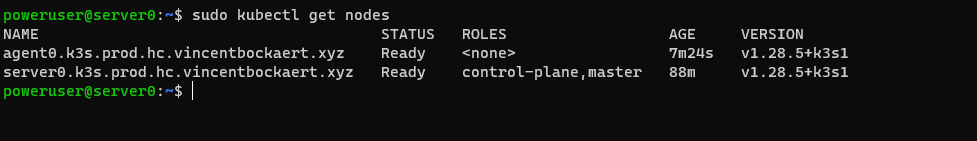

# tf-hcloud-infra

This repository houses the infrastructure provisioning on hetzner cloud through Hashicorp Terraform,
with a GCS bucket being used to store the terraform state.

Currently, using it for a self-managed Kubernetes cluster (k3s) with Hetzner Cloud Load Balancer.

There's not a lot to see, as Hetzner is pretty barebones, but in return you get very good price-to-performance and a lot of freedom to do what you want.


Out of the gate I have the following provisioned:
- vpc
    - kind of ... there's no NAT Gateway like in aws but I'm okay with that because of IPv6 public connectivity
- subnet splitting
- couple o' servers 
- cloud-init
    - pre-config the servers with dedicated sudo user
    - configure ***ssh ca certificates*** for Trusted Host Keys (so cool bro, no more fingerprint prompting)

## Prerequisites

- hetzner cloud account and project
- gcs bucket (optional as you could use local state or other remote)
    - if using gcs bucket, gcloud cli
- .env file with your a API token for your hetzner cloud project
    - I use 1Password credential referencing in the file, other tools like [sops](https://github.com/getsops/sops) exists that offer something close/similar

## Getting started

```bash
op run --env-file .env -- terraform init
op run --env-file .env -- terraform plan -out plan.out
# if plan looks good, apply:
op run --env-file .env -- terraform apply plan.out
```

## k3s

First time setup on first k3s **server**:

```bash
# requires ipv4 connectivity because GitHub is called in background ... and GitHub is IPv4 only FFS
# master.k3s.prod.hc.vincentbockaert.xyz being a load balancer listening on 6443 forwarding requests to the k3s server(s) at 6443
curl -sfL https://get.k3s.io | INSTALL_K3S_EXEC="agent" sh -s - --tls-san="master.k3s.prod.hc.vincentbockaert.xyz" --disable-cloud-controller --disable=servicelb --disable=traefik --flannel-backend=wireguard-native --write-kubeconfig-mode=644
sudo cat /var/lib/rancher/k3s/server/node-token # need this when adding agents
```

Then on the agent:

```bash
# verify connectivity to the master endpoint
curl -v --insecure https://master.k3s.prod.hc.vincentbockaert.xyz:6443
# install k3s-agent service and join the cluster
curl sfL https://get.k3s.io | INSTALL_K3S_EXEC="agent --server 'https://master.k3s.prod.hc.vincentbockaert.xyz:6443' --token 'ULTRA_SUPER_SECRET_TOKEN'" sh -s -
```

Lastly, you can verify the nodes on the server machine:

```bash
sudo kubectl get nodes
```

Which should return something similar to the below:

